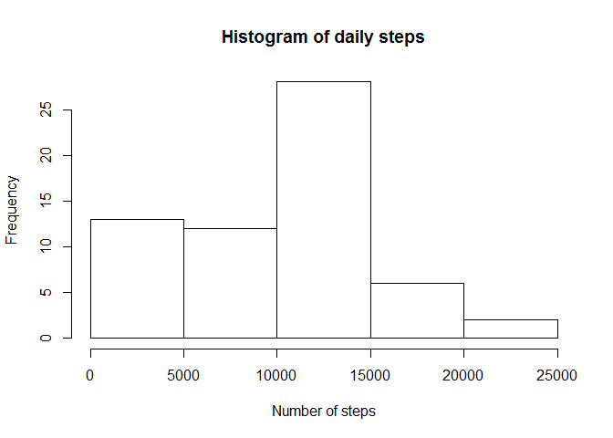
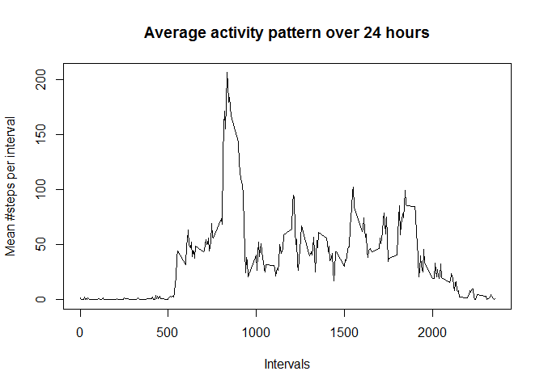
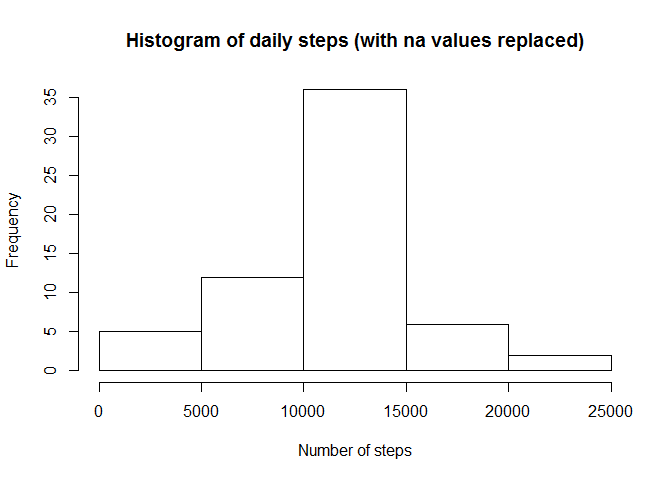
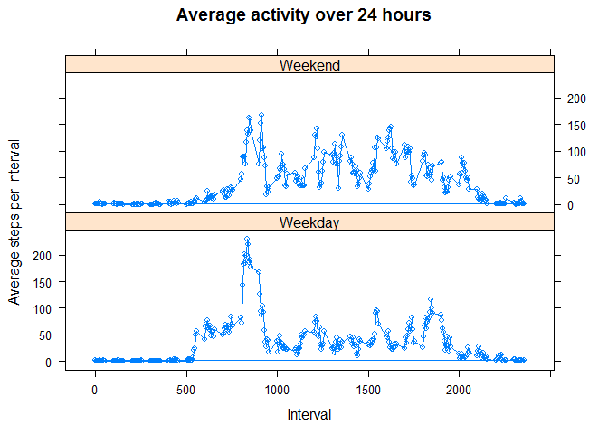

# Reproducible Research: Peer Assessment 1


## Loading and preprocessing the data


```r
unzip("activity.zip")

act_df <- read.csv("activity.csv")
```

## What is mean total number of steps taken per day?

```r
total_steps_per_day <- tapply(act_df$steps, act_df$date, sum, na.rm = TRUE)
hist(total_steps_per_day, main = "Histogram of daily steps", xlab = "Number of steps")
```

 

```r
cat("mean steps walked over all days: ",mean(total_steps_per_day, na.rm=TRUE), "\n")
```

```
## mean steps walked over all days:  9354.23
```

```r
cat("median steps walked over all days: ",median(total_steps_per_day, na.rm=TRUE), "\n")
```

```
## median steps walked over all days:  10395
```

## What is the average daily activity pattern?

```r
mean_steps_per_interval <- tapply(act_df$steps, act_df$interval, mean, na.rm = TRUE)

### tapply returns an array. I then convert to a dataframe
df <- as.data.frame(mean_steps_per_interval)
df$interval = rownames(df)

plot(df$interval, df$mean_steps_per_interval, type ="l", xlab = "Intervals", ylab = "Mean #steps per interval", main = "Average activity pattern over 24 hours")
```

 

```r
### Calculating the interval with the highest average
df[df$mean_steps_per_interval==max(df$mean_steps_per_interval),1:2]
```

```
##     mean_steps_per_interval interval
## 835                206.1698      835
```

## Imputing missing values

```r
###The number of records with missing steps data is:
sum(is.na(act_df["steps"]))
```

```
## [1] 2304
```

###Plan is to fill blanks with mean values for the respective interval

###Fill in the blanks

```r
###By joining our previously created data frame using the merge command, we can access the mean values
library(plyr)
mergeDf <- join(act_df,df)
```

```
## Joining by: interval
```

```r
###Now we can set the na values to be the interval means
mergeDf[is.na(mergeDf["steps"]), "steps"] = mergeDf[is.na(mergeDf["steps"]),"mean_steps_per_interval"]
```

### Now recreate the histogram as before

```r
total_steps_per_day <- tapply(mergeDf$steps, mergeDf$date, sum)
hist(total_steps_per_day, main = "Histogram of daily steps (with na values replaced)", xlab = "Number of steps")
```

 

```r
cat("mean steps walked over all days (with na values replaced): ",mean(total_steps_per_day, na.rm=TRUE), "\n")
```

```
## mean steps walked over all days (with na values replaced):  10766.19
```

```r
cat("median steps walked over all days (with na values replaced): ",median(total_steps_per_day, na.rm=TRUE), "\n")
```

```
## median steps walked over all days (with na values replaced):  10766.19
```

## Are there differences in activity patterns between weekdays and weekends?

```r
### Add a new factor column that highlights whether the date is a weekday or not
library(lubridate)
```

```
## Warning: package 'lubridate' was built under R version 3.1.2
```

```
## 
## Attaching package: 'lubridate'
## 
## The following object is masked from 'package:plyr':
## 
##     here
```

```r
mergeDf_wk <- mutate(
              mergeDf, wkend=factor(
                                  weekdays(ymd(as.character(mergeDf$date))) %in% c("Saturday", "Sunday")
                                  , labels = c("Weekday","Weekend")))
```

#What is the average daily activity pattern?

```r
###Get the mean #steps grouping by interval and whether or not it was a weekend
agg <- aggregate( mergeDf_wk[,"steps"], mergeDf_wk[,c("interval","wkend")], FUN = mean )

###The resulting aggregate is held in the x column
big_join <- join(mergeDf_wk,agg)
```

```
## Joining by: interval, wkend
```

```r
library(lattice)
xyplot(x~interval|wkend, data=big_join, layout=c(1,2), main = "Average activity over 24 hours", xlab = "Interval", ylab = "Average steps per interval", type = "o")
```

 
